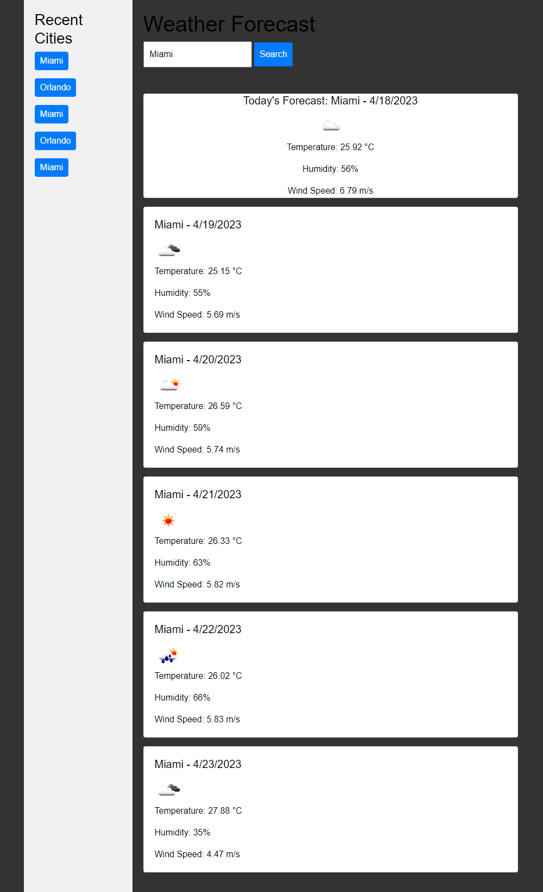

# trackZweather
A simple weather tracker app.

## Reason for Creation

Let's be honest here, I created this for class, I even put off doing it for weeks because of how useless I found it. If I wanted to look at weather forecast I'd use my phones built in app on it's homescreen.

## No Install Necessary

- Start by opening the index file in your browser
- Then type in What city you want to know about

## Current Issues

- Locally stored data works even after refresh, however due to the way I implemented the code, it only shows up after doing 1 search. Good enough for now, however I should probably rewrite the code using more functions so I can make it more simple.

## Screen Shot

### [Github](https://github.com/sobewon/trackZweather )